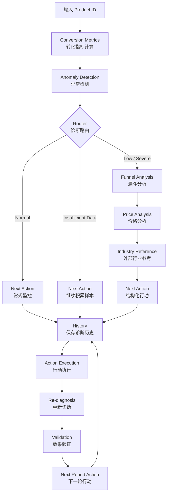

# E-commerce Conversion Diagnosis Agent
## 电商转化率诊断 Agent

一个基于真实电商行为数据构建的 **Conversion Diagnosis Agent（转化诊断智能体）**。

项目以 TheLook 电商数据为基础，通过确定性的转化指标计算、异常检测、漏斗定位、价格分析、结构化行动生成以及历史复诊验证，持续定位 SKU 的转化问题，并根据验证结果自动调整下一轮行动策略。

它不是一个单纯依靠 LLM 生成分析报告的 Demo，而是一套：

> **数据 → 诊断 → 行动 → 执行 → 复诊 → 验证 → 下一轮行动**

的完整业务闭环。

---

# 1. Business Problem｜业务问题

在真实电商业务中，发现某个商品购买转化率偏低，只是问题的开始。

真正需要继续回答的是：

```text
商品转化率低
        ↓
是否真的异常？
        ↓
相对于同品类表现如何？
        ↓
问题主要发生在哪个漏斗阶段？
        ↓
商品页 → 购物车？
购物车 → 购买？
        ↓
当前证据能确认什么？
        ↓
还有哪些因素需要进一步验证？
        ↓
下一步具体应该补什么数据、做什么行动？
        ↓
行动执行之后有没有改善？
        ↓
如果没有改善，下一轮应该怎么调整？
```

因此，本项目的目标不是输出一次性的“分析结论”，而是构建一个能够持续工作的 **Closed Loop Diagnosis System（闭环诊断系统）**。

---

# 2. Core Capabilities｜核心能力

当前 Agent 包含以下核心能力：

### 1. Conversion Metrics（转化指标计算）

基于用户 Session 行为计算：

- Product Sessions（商品页访问会话）
- Product → Cart Rate（商品页 → 购物车转化率）
- Product → Purchase CVR（商品页 → 购买转化率）
- Cart → Purchase Rate（购物车 → 购买转化率）

---

### 2. Category Benchmark（品类基准）

将当前 SKU 与所属 Category（品类）的整体表现进行比较：

```text
当前 SKU
    VS
同品类 Benchmark
```

用于判断：

- 当前商品是否明显偏离品类正常水平
- 偏离程度有多大
- 哪一个漏斗阶段相对较弱

---

### 3. Conversion Anomaly Detection（转化异常检测）

通过确定性的 Rule Engine（规则引擎）进行异常判断。

当前诊断状态包括：

```text
normal
未触发异常

low
轻度异常

severe
严重异常

insufficient_data
数据不足
```

LLM 不负责决定商品是否异常。

核心异常状态由代码规则确定，避免模型自由发挥导致诊断标准漂移。

---

### 4. Funnel Weak Stage Localization（漏斗薄弱环节定位）

进一步将整体转化问题拆分到两个核心阶段：

```text
Product → Cart
商品页 → 购物车

Cart → Purchase
购物车 → 购买
```

可能输出：

```text
product_to_cart
商品页 → 购物车异常

cart_to_purchase
购物车 → 购买异常

both
两个阶段均异常

none
当前没有明确弱环节
```

需要强调：

> **异常阶段定位 ≠ 因果原因判断。**

Agent 可以确认“问题主要发生在哪里”，但不会仅根据转化率直接推断“为什么发生”。

---

### 5. Structured Next Action（结构化下一步行动）

诊断结果不会只输出自然语言建议，而是生成固定结构的 Action Contract（行动结构约定）。

例如：

```json
{
  "priority": "P1",
  "action_type": "expand_investigation",
  "target_stage": "cart_to_purchase",
  "required_data": [
    "same_category_sku_comparison",
    "same_price_band_benchmark",
    "historical_conversion_trend"
  ],
  "reason": "上一轮行动完成后，复诊结果未观察到转化改善",
  "goal": "扩大验证范围，进一步定位尚未被当前证据解释的转化阻力"
}
```

核心字段：

| 字段 | 含义 |
|---|---|
| `priority` | 行动优先级 |
| `action_type` | 行动类型 |
| `target_stage` | 当前目标漏斗阶段 |
| `required_data` | 下一步需要补充的数据 |
| `reason` | 为什么执行这个行动 |
| `goal` | 希望通过行动解决什么问题 |

---

### 6. Closed Loop Validation（闭环效果验证）

Agent 不会在给出建议后停止。

行动执行完成后，可以基于新的业务数据再次运行诊断：

```text
Diagnosis
诊断
    ↓
Action
行动
    ↓
Execution
执行
    ↓
Re-diagnosis
复诊
    ↓
Validation
效果验证
    ↓
Next Round Action
下一轮行动
```

验证结果包括：

```text
improved
改善

unchanged
无变化

worsened
恶化

unknown
无法判断
```

不同验证结果会生成不同的下一轮策略。

例如：

```text
上一轮行动已完成
        ↓
重新诊断
        ↓
转化表现无变化
        ↓
Validation Result = unchanged
        ↓
expand_investigation
扩大调查范围
```

这使 Agent 从一次性诊断工具升级为持续迭代的业务诊断系统。

---

# 3. Agent Architecture｜Agent 架构

项目使用 LangGraph 构建 Agent Workflow（智能体工作流）。



---

# 4. Deterministic Logic + LLM｜规则与大模型职责分离

本项目刻意没有让 LLM 决定所有业务逻辑。

整体职责分为两层。

## Deterministic Layer（确定性逻辑层）

负责：

- 数据读取
- 指标计算
- Category Benchmark
- 异常阈值判断
- Funnel 弱环节定位
- Action Contract
- Validation Result
- Next Round Action
- History 状态管理

这些核心业务事实由 Python 规则确定。

---

## LLM Layer（大模型层）

负责：

- 将结构化结果翻译成业务语言
- 整理诊断报告
- 解释指标关系
- 提高报告可读性

LLM 不允许：

- 修改核心异常状态
- 自行创造统计显著性
- 自行修改行动目标
- 将相关性描述为因果关系
- 将未执行的 Tool 解释为“数据不存在”

因此整体设计原则是：

> **规则负责决定事实，LLM 负责解释事实。**

---

# 5. Metric Methodology｜指标方法

## 5.1 Product Sessions

当前商品被访问过的唯一 Session 数：

```text
Product Sessions
=
COUNT(DISTINCT session_id)
```

---

## 5.2 Product → Cart Rate

```text
发生 Cart 的唯一 Product Session
----------------------------------
      Product Sessions
```

---

## 5.3 Product → Purchase CVR

```text
发生 Purchase 的唯一 Product Session
--------------------------------------
          Product Sessions
```

---

## 5.4 Cart → Purchase Rate

```text
发生 Purchase 的唯一 Session
------------------------------
   发生 Cart 的唯一 Session
```

---

## 5.5 Relative Deviation｜相对偏离

SKU 与 Category Benchmark 的相对偏离：

```text
SKU Metric - Category Metric
----------------------------
       Category Metric
```

即：

```python
deviation = (
    sku_metric - category_metric
) / category_metric
```

例如：

```text
SKU CVR = 13%

Category CVR = 26%

Relative Deviation ≈ -50%
```

这里的 `-50%` 是：

> SKU 相对于 Category Benchmark 的相对偏离

而不是：

> “损失了 50 个百分点”。

Relative Deviation（相对偏离）与 Percentage Point Difference（百分点差）必须严格区分。

---

# 6. Data Attribution Validation｜数据归因验证

在项目开发过程中，对 Session-level Event（会话级事件）向 Product-level Metric（商品级指标）的映射进行了专门的数据完整性验证。

原因是：

`product` Event 可以直接从 URI 中得到 `product_id`：

```text
/product/7498
```

但是：

```text
/cart
/purchase
```

本身不包含 `product_id`。

因此理论上存在一个潜在风险：

```text
一个 Session 浏览商品 A
一个 Session 浏览商品 B
最后购买商品 B
        ↓
如果直接按照 Session 归因
        ↓
商品 A 可能也被错误认为发生 Purchase
```

针对这一风险，对 TheLook 全量 Events 数据进行了验证。

## 验证结果

### Session 中唯一商品数量

```text
商品浏览 Session：681,755

单商品 Session：
681,755
100.00%

多商品 Session：
0
0.00%
```

即：

> 当前 TheLook 数据中，一个 Session 始终只对应一个唯一 Product。

---

### Cart Attribution（加购归因）

```text
Cart Event：
596,438

前一个 Event 直接为 Product：
596,438

直接归因比例：
100.00%
```

说明：

```text
Product
↓
Cart
```

在当前数据中具有稳定的行为序列关系。

---

### Purchase Session

```text
Purchase Session：
181,755

单商品 Purchase Session：
181,755

多商品 Purchase Session：
0
```

即：

> 所有 Purchase Session 均只有一个唯一 Product。

---

### Purchase ⊆ Cart

进一步验证：

```text
Cart Session：
432,366

Purchase Session：
181,755

同时存在 Cart 的 Purchase Session：
181,755

没有 Cart 的 Purchase Session：
0

覆盖率：
100.00%
```

满足：

```text
Purchase Sessions ⊆ Cart Sessions
```

因此当前：

```text
Product → Cart
Product → Purchase
Cart → Purchase
```

的 Session-level Funnel（会话级漏斗）在这份 TheLook 数据结构下成立。

---

## Engineering Improvement｜工程加固

虽然当前 TheLook 数据不存在多商品 Session，但为了保证代码未来迁移到真实业务数据时仍保持 Grain（统计粒度）一致，Category 和 SKU 的漏斗分子均显式使用：

```python
category_cart_sessions = (
    category_data.loc[
        category_data["has_cart"],
        "session_id"
    ]
    .nunique()
)

category_purchase_sessions = (
    category_data.loc[
        category_data["has_purchase"],
        "session_id"
    ]
    .nunique()
)
```

保证：

```text
分母 = Unique Session

分子 = Unique Session
```

避免未来在 Multi-product Session（多商品会话）数据中产生重复计数。

---

# 7. Diagnostic Logic｜诊断逻辑

Agent 首先检查数据量。

当商品访问 Session 数不足最低诊断要求时：

```text
status = insufficient_data
```

此时只展示原始指标，不进行：

- 异常判断
- Funnel 弱环节判断
- 价格异常判断
- 因果假设生成
- 行业对比结论

下一步行动为继续积累样本，并在数据达到要求后重新诊断。

---

当数据量满足诊断条件后，Rule Engine 根据 SKU CVR 与 Category Benchmark 的偏离程度输出：

```text
normal
low
severe
```

对于异常商品进一步拆分：

```text
Product → Cart

Cart → Purchase
```

并判断：

```text
product_to_cart
cart_to_purchase
both
none
```

---

# 8. Evidence Boundary｜证据与因果边界

项目中刻意区分四个层级：

```text
Fact
事实
↓
Rule Judgment
规则判断
↓
Hypothesis
待验证假设
↓
Causal Conclusion
因果结论
```

例如：

```text
事实：
SKU Cart → Purchase Rate 低于 Category Benchmark

规则判断：
Cart → Purchase 达到当前异常阈值

可以得出：
主要异常阶段位于购物车 → 购买

不能直接得出：
用户因为价格太高所以没有购买
```

因此报告会明确说明：

> **现有证据不足以确定因果原因。**

价格、运费、支付方式、库存、配送等，只能作为下一步需要验证的因素。

---

# 9. Price Analysis｜价格分析

对于异常商品，Agent 会计算当前商品在所属 Category 中的价格位置。

主要输出：

```text
retail_price
商品零售价

category_price_median
品类价格中位数

price_percentile
价格百分位

price_status
价格状态
```

价格状态包括：

```text
high
价格位置偏高

normal
正常区间

low
价格位置偏低
```

需要强调：

> `price_status = high` 只表示商品价格处于当前品类较高位置，不代表价格已经被证明是转化下降的原因。

---

# 10. Industry Reference｜行业参考

项目引入 Dynamic Yield Benchmark 作为外部行业背景参考。

但 TheLook 与 Dynamic Yield：

- 数据来源不同
- 时间范围不同
- 样本构成不同
- 指标统计口径不同

因此：

> Dynamic Yield 不参与当前 Agent 的异常阈值计算，也不会被直接用于判断 SKU 高于或低于行业水平。

它仅作为：

```text
Industry Context
行业背景参考
```

---

# 11. Action Status｜行动状态

每一次诊断生成的行动具有独立生命周期：

```text
pending
待执行

↓

in_progress
执行中

↓

completed
执行完成

↓

validated
完成复诊验证
```

其中：

```text
completed
```

只代表：

> 行动已经执行完成。

并不代表：

> 行动已经有效。

只有新的业务数据产生后再次诊断，系统才会进入：

```text
validated
```

并产生 Validation Result（验证结果）。

---

# 12. Closed Loop Logic｜闭环逻辑

上一轮行动完成后：

```text
Previous Diagnosis
上一轮诊断
        ↓
Previous Action
上一轮行动
        ↓
Completed
执行完成
        ↓
New Business Data
新业务数据
        ↓
Re-diagnosis
复诊
        ↓
Compare
前后对比
        ↓
Validation Result
效果验证
```

不同验证结果对应不同策略。

### Improved

```text
improved
↓
monitor_after_improvement
↓
持续监控改善是否稳定
```

### Unchanged

```text
unchanged
↓
expand_investigation
↓
扩大验证范围
```

### Worsened

```text
worsened
↓
escalate_investigation
↓
升级调查
```

### Unknown

```text
unknown
↓
collect_validation_data
↓
补充验证数据
```

---

# 13. Product UI｜产品页面

项目使用 Streamlit 构建交互式业务页面。

最终页面采用：

```text
顶部 Product ID 输入
        ↓
① 商品 + 诊断总览
        ↓
② 核心转化漏斗
        ↓
③ 诊断结论
        ↓
④ 可能影响因素（待验证）
        ↓
⑤ 下一步行动
        ↓
诊断历史与闭环
        ↓
完整诊断报告
```

页面重点不是展示模型内部字段，而是将：

```text
severe
cart_to_purchase
expand_investigation
```

翻译成：

```text
严重异常
购物车 → 购买
扩大调查范围
```

形成 Business Translation Layer（业务翻译层）。

---

## 页面展示

建议后续将最终截图放入：

```text
docs/images/
```

例如：

```markdown


```

推荐只保留三张核心截图：

1. 商品诊断总览 + 转化漏斗
2. 下一步行动 + Action Status
3. Closed Loop + History

---

# 14. Example Diagnosis｜诊断示例

以异常 SKU 为例，Agent 可以形成如下业务链路：

```text
购买转化率明显低于 Category Benchmark
        ↓
整体状态达到严重异常规则
        ↓
拆解 Funnel
        ↓
主要弱环节：
购物车 → 购买
        ↓
当前证据不足以判断具体原因
        ↓
收集：
结账步骤漏斗
购物车放弃原因
运费与税费
支付方式
库存与配送
        ↓
行动执行
        ↓
再次诊断
        ↓
转化表现未改善
        ↓
Validation Result：
unchanged
        ↓
Next Round Action：
expand_investigation
        ↓
进一步检查：
同品类商品对比
同价格带商品对比
历史转化趋势
```

这体现了 Agent 的核心价值：

> 不只是“告诉你发生了什么”，而是持续推动下一步问题验证。

---

# 15. Technology Stack｜技术栈

### Data

- TheLook E-commerce Dataset
- Pandas
- Excel / CSV

### Agent

- Python
- LangGraph
- LangChain
- Structured Output
- Rule Engine

### LLM

- DeepSeek
- `deepseek-v4-flash`

### Product UI

- Streamlit
- Altair

### Engineering

- Git
- GitHub
- `.env`
- JSONL History

---

# 16. Project Structure｜项目结构

```text
agent/
│
├── app.py
│
├── README.md
│
│
├── data/
│   ├── events_old.csv
│   ├── orders.csv
│   ├── order_items.csv
│   ├── products_old.csv
│   ├── inventory_items_old.csv
│   ├── users_old.csv
│   ├── distribution_centers.csv
│   ├── industry_benchmark_comparison.xlsx
│   └── diagnosis_history_business.jsonl
│
├── src/
│   ├── conversion_diagnosis_agent.py
│   ├── diagnosis_history.py
│   │
│   └── rules/
│       └── conversion_anomaly.py
│
├── experiments/
│   ├── phase2_langchain/
│   ├── phase5_closed_loop/
│   └── ...
│
└── .env
```

> 大型原始数据、API Key、运行历史文件建议根据实际情况加入 `.gitignore`，避免直接上传 GitHub。

---

# 17. How to Run｜运行方式

## 1. 创建 Python 环境

推荐使用独立虚拟环境。

例如：

```bash
conda activate agent
```

---

## 2. 安装依赖

根据项目环境安装：

```bash
pip install pandas
pip install streamlit
pip install altair
pip install langgraph
pip install langchain
pip install langchain-openai
pip install python-dotenv
pip install openpyxl
```

后续建议统一生成：

```text
requirements.txt
```

---

## 3. 配置 API Key

项目根目录创建：

```text
.env
```

写入：

```text
DEEPSEEK_API_KEY=your_api_key
```

不要将 `.env` 上传到 GitHub。

---

## 4. 启动 Streamlit

项目根目录：

```bash
streamlit run app.py
```

然后在页面输入：

```text
Product ID
```

即可开始诊断。

---

# 18. Methodological Boundaries｜方法边界

为了避免过度解释，当前项目遵守以下限制。

### 1. 异常不等于因果

发现某一 Funnel 阶段异常，不代表已经知道异常原因。

---

### 2. Relative Deviation 不等于百分点差

```text
Relative Deviation
```

表示相对于 Benchmark 的比例偏离，而不是 Percentage Point Difference。

---

### 3. Price Position 不等于 Price Cause

价格位置较高只能作为待验证因素，不能直接解释转化下降。

---

### 4. External Benchmark 仅作为背景参考

Dynamic Yield 与 TheLook 的统计口径不同，因此不参与 Agent 的核心异常规则。

---

### 5. Closed Loop 依赖新的业务数据

行动执行完成后，如果底层数据没有变化：

```text
Re-diagnosis
```

仍然会得到相同指标。

这属于正确行为，而不是系统错误。

---

### 6. 当前 Session Attribution 基于 TheLook 数据结构

目前全量验证发现：

```text
1 Session = 1 Unique Product
```

因此 Session-level Cart / Purchase 可以稳定映射至该 Session 的唯一商品。

如果未来迁移到真实业务数据，应重新检查：

```text
Multi-product Session
多商品会话

Product-level Cart Attribution
商品级加购归因

Order-level Purchase Attribution
订单级购买归因
```

不能直接假设真实数据与 TheLook 具有相同结构。

---

# 19. Project Highlights｜项目亮点

## 1. 真实数据驱动，而不是纯 Prompt Demo

核心诊断依据来自 TheLook 用户行为和商品数据，而不是让 LLM 自行生成事实。

---

## 2. Rule + LLM Hybrid Architecture

通过：

```text
Deterministic Rule
+
LLM Explanation
```

同时保证诊断稳定性和业务可读性。

---

## 3. Structured Action，而不是自然语言建议

Agent 输出具有固定字段的 Action Contract，可以被程序继续执行、追踪和验证。

---

## 4. 真正的 Closed Loop

项目包含：

```text
Diagnosis
→ Action
→ Execution
→ Re-diagnosis
→ Validation
→ Next Action
```

而不是在生成第一份报告后结束。

---

## 5. 明确区分事实、判断与假设

避免：

```text
转化下降
→ 直接猜价格、支付、物流原因
```

而是采用：

```text
事实
↓
规则判断
↓
待验证假设
↓
补充数据
↓
再次验证
```

---

## 6. 对底层指标进行了 Data Validation

项目不仅实现了 Agent Workflow，也对：

- Session 与 Product 关系
- Cart Attribution
- Purchase Attribution
- Funnel 完整性
- Category Benchmark Grain

进行了额外的数据假设验证。

避免在错误指标基础上继续构建上层 Agent。

---

# 20. Future Improvements｜后续可扩展方向

当前版本已经完成完整诊断闭环，后续可以继续扩展：

### 数据层

- 接入真实电商埋点
- Product-level Cart Event
- Checkout Step Funnel
- Traffic Source
- Inventory
- Shipping
- Payment Method

### 诊断层

- 时间趋势异常检测
- 同价格带 Benchmark
- 同类 SKU 横向比较
- Traffic Source 分层诊断

### Agent 层

- Tool 自动选择
- 动态调查计划
- 更细粒度 Validation
- 长期 Diagnosis Memory

### 产品层

- 多 SKU 批量诊断
- 异常商品排行榜
- Dashboard
- 自动生成业务周报
- 行动任务管理

---

# 21. Summary｜项目总结

这个项目尝试解决的不是：

> “如何让 LLM 分析一组电商数据？”

而是：

> **如何把数据分析、业务规则、Agent Workflow、行动管理和反馈验证组合成一个能够持续工作的业务诊断系统。**

最终形成：

```text
数据
↓
指标
↓
异常识别
↓
问题定位
↓
结构化行动
↓
执行
↓
复诊
↓
效果验证
↓
下一轮行动
```

这也是本项目最核心的设计目标：

> **让 Agent 不只输出答案，而是推动业务问题持续向下一步解决。**