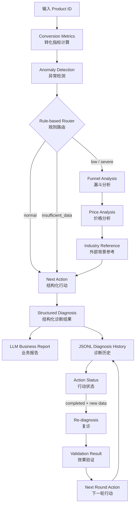

<div align="center">

# 🛒 电商 SKU 转化异常诊断与闭环验证 Agent


</div>

---

<a id="项目亮点"></a>

## ✨ 项目亮点

- 基于 TheLook 公开合成电商数据，而不是由 LLM 虚构指标
- 使用确定性规则计算 CVR、Category Benchmark 和异常等级
- 根据 `normal / low / severe / insufficient_data` 进行条件路由
- 对异常 SKU 定位 `Product → Cart` 与 `Cart → Purchase` 薄弱环节
- 将价格位置与行业参考作为辅助证据，不直接推断因果关系
- 输出结构化 Action Contract，而不是只有自然语言建议
- 支持 Action Status、复诊对比、Validation Result 和 Next Round Action
- 使用 Streamlit 将技术字段翻译成业务可读界面

<a id="目录"></a>

## 🧭 目录

- [快速开始](#快速开始)
- [产品页面](#产品页面)
- [业务问题](#业务问题)
- [四类验证案例](#四类验证案例)
- [系统架构](#系统架构)
- [核心能力](#核心能力)
- [规则与 LLM 职责分离](#规则与-llm-职责分离)
- [证据边界](#证据边界)
- [闭环验证](#闭环验证)
- [指标与数据口径](#指标与数据口径)
- [项目结构](#项目结构)


<a id="业务问题"></a>

## 🎯 业务问题

发现某个商品购买转化率偏低，只是分析的起点。业务还需要回答：

1. 样本量是否足以支持诊断？
2. SKU 相对于同品类表现是否异常？
3. 问题主要发生在商品页到购物车，还是购物车到购买？
4. 当前证据能确认什么，哪些原因仍需进一步验证？
5. 下一步应该补充什么数据、采取什么行动？
6. 行动完成后是否改善，下一轮策略是什么？

本项目将这些问题组织为一条可重复运行的诊断链路，而不是生成一次性的分析文本。

<a id="四类验证案例"></a>

## 🧪 四类验证案例

以下案例来自当前 TheLook 数据快照，并按照同一套确定性规则执行。它们用于验证路由与业务边界，不代表模型准确率或统计显著性。

| Product ID | 预期状态 | 关键证据 | 系统行为 |
|---:|---|---|---|
| `7498` | `severe` 严重异常 | 23 Sessions；SKU CVR 13.04%，Category CVR 26.57%，相对偏离 -50.91% | 进入漏斗与价格分析，主要薄弱环节为购物车→购买 |
| `4680` | `low` 轻度异常 | 20 Sessions；SKU CVR 15.00%，Category CVR 26.68%，相对偏离 -43.78% | 进入深度诊断，定位主要薄弱环节 |
| `19681` | `normal` 未触发异常 | 31 Sessions；SKU CVR 25.81%，Category CVR 26.38%，相对偏离 -2.18% | 不执行不必要的深度诊断，生成常规监控行动 |
| `16599` | `insufficient_data` 数据不足 | 19 Sessions，低于当前门槛 20 | 不判断异常、不定位弱环节、不执行价格或行业解释 |

四类案例体现的不是“每个商品都必须得到复杂结论”，而是 Agent 能根据证据状态选择继续分析或安全停止。

<a id="系统架构"></a>

## 🏗️ 系统架构

系统分为两层：LangGraph 负责单次诊断工作流，应用层负责历史、行动状态、复诊和效果验证。



### LangGraph 诊断节点与路由

| 节点 | 职责 |
|---|---|
| `conversion_metrics` | 计算 SKU 与 Category 漏斗指标 |
| `anomaly_detection` | 根据样本门槛和 CVR 相对偏离输出状态 |
| `anomaly_router` | 按状态决定是否进入深度诊断 |
| `funnel_analysis` | 定位 Product→Cart、Cart→Purchase 薄弱环节 |
| `price_analysis` | 计算 SKU 在所属品类中的价格位置 |
| `industry_benchmark` | 加载外部行业背景参考，不参与异常阈值 |
| `next_action` | 生成结构化行动建议 |

`Diagnosis History、Validation、Next Round Action` 由统一入口和应用层衔接，不伪装成 LangGraph 内部节点。

<a id="核心能力"></a>

## 🧩 核心能力

### 1. Conversion Metrics｜转化指标

基于唯一 Session 计算：

- Product Sessions
- Product → Cart Rate
- Product → Purchase CVR
- Cart → Purchase Rate

### 2. Category Benchmark｜品类基准

将当前 SKU 与所属 Category 的总体表现对照，用于判断 SKU 是否偏离品类水平、偏离程度以及哪个漏斗阶段相对较弱。Category Benchmark 是当前数据快照中的内部对照，不是行业标准。

### 3. Conversion Anomaly Detection｜异常检测

核心状态由 Python Rule Engine 决定：

| 状态 | 当前规则 |
|---|---|
| `insufficient_data` | Product Sessions < 20 |
| `severe` | CVR 相对 Category Benchmark 偏离 ≤ -50% |
| `low` | CVR 相对 Category Benchmark 偏离 ≤ -30% |
| `normal` | 未触发以上异常规则 |

这里的阈值是项目规则，不等同于统计显著性检验。

### 4. Funnel Weak Stage｜漏斗薄弱环节

对于 `low / severe` 商品，进一步分析：

- `product_to_cart`：商品页 → 购物车
- `cart_to_purchase`：购物车 → 购买
- `both`：两个阶段均触发规则
- `none`：当前没有明确薄弱环节

异常阶段定位只能说明问题集中在哪里，不能直接说明为什么发生。

### 5. Price Analysis｜价格位置

输出 SKU 价格、Category 中位数、价格百分位与 `high / normal / low` 价格状态。价格位置是描述性证据，不证明价格导致转化下降。

### 6. Structured Action｜结构化行动

Agent 使用固定 Action Contract 输出下一步行动：

```json
{
  "priority": "P1",
  "action_type": "expand_investigation",
  "target_stage": "cart_to_purchase",
  "required_data": [
    "same_category_sku_comparison",
    "same_price_band_benchmark",
    "historical_conversion_trend"
  ],
  "reason": "上一轮行动完成后，复诊结果未观察到转化改善",
  "goal": "扩大验证范围，进一步定位尚未被当前证据解释的转化阻力"
}
```

结构化字段可以继续被历史管理和闭环逻辑读取，而不是停留在自然语言报告中。

<a id="规则与-llm-职责分离"></a>

## 🧠 规则与 LLM 职责分离

本项目采用 **Deterministic Rules + LLM Explanation（确定性规则 + 大模型解释）** 的混合架构。

| 确定性逻辑负责 | LLM 负责 |
|---|---|
| 数据读取与指标计算 | 将结构化结果翻译为业务语言 |
| Category Benchmark | 组织诊断报告 |
| 样本门槛与异常状态 | 解释指标之间的关系 |
| 漏斗薄弱环节 | 提高报告可读性 |
| Price Status | 不修改核心诊断事实 |
| Action Contract | 不生成不存在的数据 |
| Validation Result | 不将相关性表述为因果关系 |
| Next Round Action | 不创造显著性、p 值或置信区间 |

> 规则负责决定事实，LLM 负责解释事实。

<a id="闭环验证"></a>

## 🔄 闭环验证

每次诊断结果保存为 JSONL 历史记录，并包含 Action Status：

```text
pending → in_progress → completed → validated
```

- `completed` 只表示行动已经执行，不代表行动有效
- 上一轮行动为 `completed` 且产生新业务数据后，才能通过复诊验证效果
- 如果底层数据没有变化，复诊结果保持不变是正确行为

| 验证结果 | 含义 | 下一轮行动 |
|---|---|---|
| `improved` | 指标改善 | `monitor_after_improvement` |
| `unchanged` | 未观察到改善 | `expand_investigation` |
| `worsened` | 表现恶化 | `escalate_investigation` |
| `unknown` | 证据不足 | `collect_validation_data` |

当前闭环是可运行的验证机制原型：行动状态由用户更新，系统负责保存历史、比较复诊结果并生成下一轮行动；它没有连接真实电商平台自动执行运营动作。

<a id="产品页面"></a>

## 🖥️ 产品页面

Streamlit 页面按照业务阅读顺序组织为：

1. 商品 + 诊断总览
2. 核心转化漏斗与 Category Benchmark
3. 诊断结论与证据边界
4. 可能影响因素（待验证）
5. 下一步行动
6. 折叠式诊断历史与闭环结果
7. 完整 LLM 业务报告

页面将 `severe / cart_to_purchase / expand_investigation` 等内部字段翻译为“严重异常 / 购物车→购买 / 扩大调查范围”，形成 Business Translation Layer（业务翻译层）。

<a id="指标与数据口径"></a>

## 📐 指标与数据口径

### 核心公式

```text
Product Sessions
= COUNT(DISTINCT session_id with product view)

Product → Cart Rate
= Sessions with cart / Product Sessions

Product → Purchase CVR
= Sessions with purchase / Product Sessions

Cart → Purchase Rate
= Sessions with purchase / Sessions with cart

Relative Deviation
= (SKU Metric - Category Metric) / Category Metric
```

`Relative Deviation = -50%` 表示 SKU 相对于 Benchmark 低 50%，不表示低 50 个百分点。

### Session Attribution 验证

项目在当前 TheLook 数据快照上验证了 Session Event 到 Product Metric 的映射前提：

- 单商品 Session：100%
- 多商品 Session：0%
- Cart 前存在 Product Event：100%
- Purchase Session 属于 Cart Session：100%

因此当前快照可以将 Session-level Cart/Purchase 映射到 Session 中的唯一商品。迁移到真实电商数据时，必须重新验证多商品 Session、商品级加购归因和订单级购买归因。

更多说明：

- [`docs/methodology.md`](docs/methodology.md)：指标、规则和数据归因
- [`docs/closed_loop_design.md`](docs/closed_loop_design.md)：历史、行动状态与验证分支
- [`docs/conversion_diagnosis_decision_tree.md`](docs/conversion_diagnosis_decision_tree.md)：诊断决策树

<a id="快速开始"></a>

## 🚀 快速开始

### 1. 克隆仓库

```bash
git clone https://github.com/Elaine258/Ecomm-CVR-Agent.git
cd Ecomm-CVR-Agent
```

### 2. 创建 Python 环境

```bash
conda create -n agent python=3.11 -y
conda activate agent
```

### 3. 安装依赖

```bash
pip install -r requirements.txt
```

### 4. 配置环境变量

复制 `.env.example` 为 `.env`：

```text
DEEPSEEK_API_KEY=your_api_key_here
```

如果完整数据不放在仓库的 `data/` 下，可指定绝对路径：

```text
ECOMM_DATA_DIR=E:\agent\data
```

`.env` 已被 `.gitignore` 排除，请勿提交 API Key。

### 5. 准备数据

本仓库不重新分发完整 TheLook 数据。运行核心应用至少需要：

```text
data/
├── events_old.csv
├── products_old.csv
└── industry_benchmark_comparison.xlsx
```

`events_old.csv` 和 `products_old.csv` 需要从 TheLook 数据源获取；仓库中的 `samples/` 仅用于查看字段结构，不能复现完整案例结果。详情见 [`data/README.md`](data/README.md)。

### 6. 启动 Streamlit

```bash
streamlit run app.py
```

推荐依次输入以下 Product ID 查看不同路由：

```text
7498   severe
4680   low
19681  normal
16599  insufficient_data
```

<a id="项目结构"></a>

## 📁 项目结构

```text
Ecomm-CVR-Agent/
├── app.py                              # Streamlit 交互页面
├── src/
│   ├── conversion_diagnosis_agent.py   # LangGraph 诊断工作流与统一入口
│   ├── diagnosis_history.py            # 历史、行动状态与闭环验证
│   └── rules/
│       └── conversion_anomaly.py       # 确定性异常规则
├── data/
│   ├── README.md                       # 数据来源与许可说明
│   └── industry_benchmark_comparison.xlsx
├── samples/                            # 字段样例，不用于完整诊断
├── docs/                               # 方法论、决策树与闭环说明
├── experiments/                        # 学习过程与分阶段验证
├── scripts/                            # 数据检查脚本
├── .env.example
├── .gitignore
├── requirements.txt
└── README.md
```

`experiments/` 保留了从基础概念到完整诊断闭环的学习与验证过程；正式应用入口是：

```python
from src.conversion_diagnosis_agent import diagnose_product
```

<a id="证据边界"></a>

## 🛡️ 证据边界

### 异常不等于因果

系统可以确认 SKU 是否触发当前规则、哪个漏斗阶段相对较弱，但不能仅凭漏斗指标确定用户心理或真实流失原因。

### Price Position 不等于 Price Cause

价格百分位是描述性证据。即使 `price_status = high`，也不能证明价格导致转化下降。

### External Benchmark 仅作背景参考

Dynamic Yield 与 TheLook 的数据来源、时间范围和统计口径不同，因此不参与 Agent 的核心异常阈值计算，也不用于直接推算 SKU 应达到的 CVR。

### 样本门槛不是显著性检验

当前最低门槛为 20 Product Sessions，只是项目的诊断保护规则，不代表结论已经通过统计显著性检验。

### Closed Loop 需要新数据

行动完成后只有底层业务数据发生变化，复诊才可能观察到指标变化。系统不会伪造“行动后提升”。
